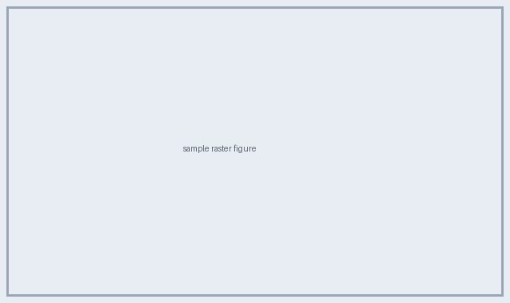

## Figure

## GRPO objective

$$\mathcal{J}_{\text{GRPO}}(\theta)=\mathbb{E}\!\left[\frac{1}{G}\sum_{i=1}^{G}\min\!\big(r_{i}\hat{A}_{i},\operatorname{clip}(r_i,1-\varepsilon,1+\varepsilon)\hat{A}_i\big)-\beta\,\mathbb{D}_{\text{KL}}(\pi_\theta\|\pi_{\text{ref}})\right]$$
